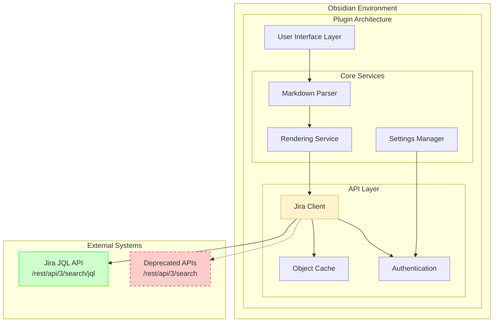
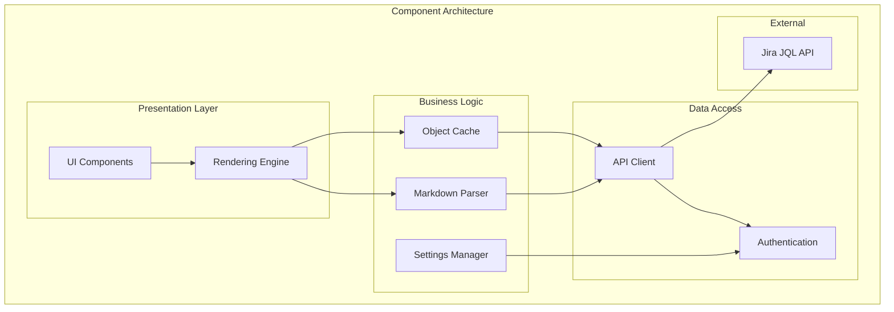
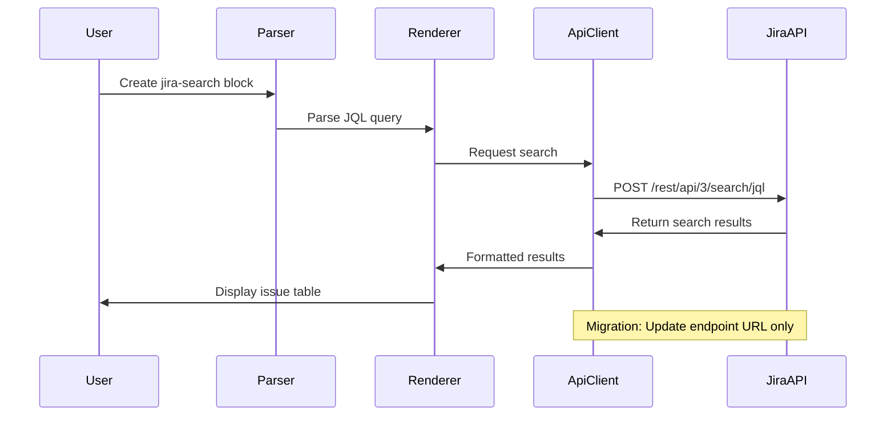

# Obsidian Jira Issue Plugin Architecture Document

## Introduction

This document outlines the overall project architecture for **Obsidian Jira Issue Plugin**, including backend systems, shared services, and non-UI specific concerns. Its primary goal is to serve as the guiding architectural blueprint for AI-driven development, ensuring consistency and adherence to chosen patterns and technologies.

**Relationship to Frontend Architecture:**  
Since this is an Obsidian plugin with significant UI components (rendering, modals, views), a separate Frontend Architecture Document would detail the frontend-specific design and MUST be used in conjunction with this document. Core technology stack choices documented herein are definitive for the entire project.

### Starter Template or Existing Project

**Project Foundation:**
This is an **existing Obsidian plugin** requiring targeted API endpoint migration. The architecture will focus on:

- **Endpoint Migration**: Replace deprecated `/rest/api/3/search` with `/rest/api/3/search/jql`
- **Request/Response Adaptation**: Handle new JQL service format
- **Minimal Disruption**: Preserve existing plugin functionality and user experience

**Migration Scope:**
- Update API client layer (`/src/api/` and `/src/client/` modules)
- Maintain existing rendering, settings, and UI components unchanged
- Focus on endpoint compatibility rather than advanced features

**Decision:** Build on existing codebase with targeted API layer updates to meet August 1, 2025 migration deadline.

### Change Log

| Date | Version | Description | Author |
|------|---------|-------------|---------|
| 2025-08-19 | 1.0 | Initial architecture document for Jira API migration | Winston (Architect) |

## High Level Architecture

### Technical Summary
The Obsidian Jira Issue plugin follows a **layered client-side architecture** with clear separation between API communication, data processing, and UI rendering. The core architectural pattern is **Service-Oriented** with a dedicated API abstraction layer that will be updated to use new Jira JQL endpoints. The plugin maintains **stateless operation** with reactive UI updates based on API responses, ensuring compatibility with Obsidian's plugin architecture while providing seamless Jira integration.

### High Level Overview

**Architectural Style:** Client-side plugin architecture with service layer pattern
**Repository Structure:** Monorepo with modular TypeScript organization
**Service Architecture:** Single plugin with multiple service modules (API, rendering, settings)

**Primary User Interaction Flow:**
1. User creates Jira components in Markdown (jira-issue, jira-search, jira-count)
2. Plugin detects and parses component syntax
3. API service layer fetches data from Jira using new JQL endpoints
4. Rendering service transforms data into UI components
5. Results displayed inline within Obsidian notes

**Key Architectural Decisions:**
- **API Abstraction**: Centralized API client layer enables clean endpoint migration
- **Component-Based Rendering**: Modular rendering system supports multiple Jira component types
- **Configuration Management**: Centralized settings with multi-account support
- **Error Boundary Pattern**: Graceful degradation for API failures

### High Level Project Diagram



### Architectural and Design Patterns

- **API Client Pattern:** Centralized HTTP client with request/response transformation - _Rationale:_ Enables clean migration from deprecated endpoints to new JQL endpoints without touching business logic
- **Command Pattern:** User actions translated to discrete commands - _Rationale:_ Supports undo/redo functionality and provides clear separation between UI events and business operations
- **Observer Pattern:** Reactive UI updates based on data changes - _Rationale:_ Maintains UI consistency when API responses arrive asynchronously
- **Service Layer Pattern:** Business logic encapsulated in dedicated service classes - _Rationale:_ Provides clean abstraction between Obsidian plugin interface and Jira API interactions
- **Template Method Pattern:** Consistent rendering pipeline for different component types - _Rationale:_ Allows specialized rendering for jira-issue, jira-search, and jira-count while maintaining consistent behavior
- **Adapter Pattern:** Transform new JQL API responses to match existing internal data structures - _Rationale:_ Minimizes changes to rendering and business logic during endpoint migration

## Tech Stack

This section documents the DEFINITIVE technology choices for the Obsidian Jira Issue plugin migration. These selections are based on the existing, production-proven stack and focus on preserving compatibility while enabling API endpoint migration.

**Migration Context:** All technology choices support the core objective of migrating from deprecated Jira APIs (`/rest/api/3/search`) to new enhanced JQL endpoints (`/rest/api/3/search/jql`) by August 1, 2025.

### Cloud Infrastructure
- **Provider:** N/A (Client-side plugin)
- **Key Services:** Browser runtime within Obsidian desktop application
- **Deployment Regions:** Global via Obsidian Community Plugin marketplace

### Technology Stack Table

| Category | Technology | Version | Purpose | Rationale |
|----------|------------|---------|---------|-----------|
| **Language** | TypeScript | 4.9.4 | Primary development language | Strong typing ensures API migration safety, existing codebase expertise |
| **Runtime** | Browser/Node.js | Latest | Execution environment | Obsidian plugin architecture requirement, Node.js for build tools |
| **Build Tool** | ESBuild | 0.16.3 | Code compilation and bundling | Fast build times, TypeScript support, production-proven |
| **Testing Framework** | Jest | 29.7.0 | Unit and integration testing | Comprehensive test coverage for migration validation |
| **Linting** | ESLint | 8.57.0 | Code quality enforcement | TypeScript rules ensure consistent code during migration |
| **HTTP Client** | Fetch API | Native | API communication | Browser-native, no additional dependencies for Jira API calls |
| **UI Framework** | Obsidian API | Latest | User interface components | Required for plugin integration, handles all UI rendering |
| **Code Editor** | CodeMirror | 6.x | Syntax highlighting | Enhanced editor experience for Jira components |
| **Date Handling** | Moment.js | 2.30.1 | Date parsing and formatting | Jira date format compatibility, existing usage |
| **Color Management** | Colorsys | 1.0.22 | Status color calculations | Issue status visualization |
| **String Processing** | escape-string-regexp | 5.0.0 | Regex escaping for JQL | Safe JQL query construction |
| **Package Manager** | pnpm | Latest | Dependency management | Fast installs, efficient disk usage |
| **Documentation** | Docusaurus | Latest | User documentation | Established docs site for migration communication |

## Data Models

### Core Business Entities

#### JiraIssue
**Purpose:** Represents a single Jira issue with all relevant metadata for display and interaction

**Key Attributes:**
- key: string - Unique Jira issue identifier (e.g., "PROJ-123")
- id: string - Internal Jira numeric ID
- summary: string - Issue title/summary
- status: IssueStatus - Current issue status with color coding
- assignee: User - Assigned user information
- reporter: User - Issue creator information
- priority: Priority - Issue priority level
- created: Date - Creation timestamp
- updated: Date - Last modification timestamp
- description: string - Full issue description

**Relationships:**
- Belongs to Project
- Has multiple Comments
- Contains multiple CustomFields

#### SearchQuery
**Purpose:** Encapsulates JQL search parameters and configuration

**Key Attributes:**
- jql: string - JQL query string
- fields: string[] - Requested field list
- expand: string[] - Expansion parameters
- maxResults: number - Result limit
- startAt: number - Starting index for pagination

**Relationships:**
- Produces SearchResults
- References multiple JiraIssues

#### ApiConfiguration
**Purpose:** Stores connection settings for Jira instances

**Key Attributes:**
- host: string - Jira server URL
- username: string - Authentication username
- apiToken: string - Authentication token
- accountId: string - User account identifier

**Relationships:**
- Used by JiraClient
- Supports multiple accounts

## Components

### API Client Component
**Responsibility:** Handles all HTTP communication with Jira APIs, including the migration from deprecated to new JQL endpoints

**Key Interfaces:**
- `searchIssues(query: SearchQuery): Promise<SearchResult>` - Main search functionality
- `getIssue(key: string): Promise<JiraIssue>` - Single issue retrieval
- `authenticate(config: ApiConfiguration): Promise<boolean>` - Authentication validation

**Dependencies:** ApiConfiguration, HTTP Fetch API, Authentication Service

**Technology Stack:** TypeScript, Fetch API, Moment.js for date handling

**Migration Notes:** This component will be updated to use `/rest/api/3/search/jql` endpoints while maintaining the same interface contract.

### Rendering Component
**Responsibility:** Transforms Jira data into UI components within Obsidian's markdown rendering pipeline

**Key Interfaces:**
- `renderIssueBlock(issues: JiraIssue[]): HTMLElement` - Issue list rendering
- `renderSearchTable(results: SearchResult): HTMLElement` - Tabular search results
- `renderInlineIssue(key: string): HTMLElement` - Inline issue badges

**Dependencies:** Jira data models, Obsidian UI API, ColorSys for status colors

**Technology Stack:** TypeScript, Obsidian API, HTML/CSS, CodeMirror integration

### Settings Component
**Responsibility:** Manages plugin configuration including multiple Jira account configurations

**Key Interfaces:**
- `getConfiguration(accountId?: string): ApiConfiguration` - Retrieve settings
- `saveConfiguration(config: ApiConfiguration): void` - Persist settings
- `validateConnection(config: ApiConfiguration): Promise<boolean>` - Test connectivity

**Dependencies:** Obsidian Settings API, ApiConfiguration model

**Technology Stack:** TypeScript, Obsidian Plugin API

### Component Diagrams



## External APIs

### Jira Enhanced JQL API
- **Purpose:** Primary data source for issue information, searches, and metadata
- **Documentation:** https://developer.atlassian.com/cloud/jira/platform/rest/v3/
- **Base URL(s):** User-configured Jira instance URLs
- **Authentication:** Basic Auth with API tokens or OAuth 2.0
- **Rate Limits:** Standard Jira Cloud rate limits apply

**Key Endpoints Used:**
- `GET /rest/api/3/search/jql` - Enhanced JQL search (replaces deprecated /search)
- `POST /rest/api/3/search/jql` - Enhanced JQL search with complex queries
- `GET /rest/api/3/issue/{issueIdOrKey}` - Single issue retrieval
- `GET /rest/api/3/myself` - User authentication validation

**Integration Notes:** Migration from deprecated `/rest/api/3/search` endpoints to new JQL endpoints maintains same authentication and most request parameters. Response format expected to be compatible with existing parsing logic.

## Core Workflows



## REST API Spec

This plugin acts as an API client only - it does not expose REST endpoints. All API communication is outbound to Jira instances configured by users.

## Database Schema

This plugin uses browser storage only - no external database. Configuration stored in Obsidian's plugin data directory using JSON format.

**Configuration Schema:**
```json
{
  "accounts": [
    {
      "id": "string",
      "name": "string", 
      "host": "string",
      "username": "string",
      "apiToken": "string"
    }
  ],
  "defaultAccount": "string",
  "renderingOptions": {
    "compactMode": "boolean",
    "showAssignee": "boolean",
    "colorScheme": "string"
  }
}
```

## Source Tree

```
obsidian-jira-issue/
├── src/
│   ├── main.ts                     # Plugin entry point
│   ├── api/                        # API communication layer
│   │   ├── apiBase.ts             # Base HTTP client (MIGRATION TARGET)
│   │   ├── api.ts                 # Core API interface
│   │   ├── apiChart.ts            # Chart data endpoints
│   │   ├── apiDefaulted.ts        # Default parameter handling
│   │   └── apiMacro.ts            # Macro expansion
│   ├── client/
│   │   └── jiraClient.ts          # Main Jira client (MIGRATION TARGET)
│   ├── interfaces/
│   │   ├── issueInterfaces.ts     # Jira data models
│   │   └── settingsInterfaces.ts  # Configuration models
│   ├── rendering/                  # UI rendering components
│   │   ├── issueFenceRenderer.ts  # jira-issue component
│   │   ├── searchFenceRenderer.ts # jira-search component
│   │   ├── countFenceRenderer.ts  # jira-count component
│   │   ├── inlineIssueRenderer.ts # Inline issue badges
│   │   └── renderingCommon.ts     # Shared rendering utilities
│   ├── modals/
│   │   └── searchWizardModal.ts   # Search query builder
│   ├── suggestions/
│   │   ├── columnsSuggest.ts      # Column name suggestions
│   │   └── querySuggest.ts        # JQL query suggestions
│   ├── settings.ts                # Settings management
│   ├── searchView.ts              # Search results view
│   ├── objectsCache.ts            # Response caching
│   └── utils.ts                   # Utility functions
├── test/                          # Test suite
├── docs-gen/                      # Documentation site
├── manifest.json                  # Plugin manifest
├── package.json                   # Dependencies
└── README.md                      # Project documentation
```

**Migration Focus Areas:**
- `src/api/apiBase.ts` - Update base URLs and request formatting
- `src/client/jiraClient.ts` - Modify search method implementations
- `src/interfaces/` - Ensure data models support new response format

## Infrastructure and Deployment

### Infrastructure as Code
- **Tool:** N/A
- **Location:** N/A
- **Approach:** Plugin distributed via Obsidian Community Plugin marketplace

### Deployment Strategy
- **Strategy:** Automated release via GitHub Actions
- **CI/CD Platform:** GitHub Actions
- **Pipeline Configuration:** `.github/workflows/`

### Environments
- **Development:** Local Obsidian vault with plugin in development mode
- **Testing:** Automated Jest test suite with mock Jira responses
- **Production:** Obsidian Community Plugin marketplace distribution

### Environment Promotion Flow
```
Development → Testing → Release → Community Plugin Store
```

### Rollback Strategy
- **Primary Method:** Version-based rollback through Obsidian's plugin version management
- **Trigger Conditions:** API compatibility issues, user-reported functionality loss
- **Recovery Time Objective:** Immediate (users can downgrade plugin version)

## Error Handling Strategy

### General Approach
- **Error Model:** Exception-based with graceful degradation for UI components
- **Exception Hierarchy:** Custom JiraError types extending base Error class
- **Error Propagation:** Errors caught at component boundaries, displayed to user with retry options

### Logging Standards
- **Library:** console (browser native)
- **Format:** Structured logging with component identification
- **Levels:** error, warn, info, debug
- **Required Context:**
  - Correlation ID: Request timestamp + component name
  - Service Context: Component name and method
  - User Context: Account ID (never log credentials)

### Error Handling Patterns

#### External API Errors
- **Retry Policy:** 3 attempts with exponential backoff for network errors
- **Circuit Breaker:** Disable API calls for 5 minutes after 3 consecutive failures
- **Timeout Configuration:** 30 second timeout for all API requests
- **Error Translation:** Map Jira error codes to user-friendly messages

#### Business Logic Errors
- **Custom Exceptions:** JiraAuthenticationError, JiraQueryError, JiraNetworkError
- **User-Facing Errors:** Display in Obsidian notice system with suggested actions
- **Error Codes:** Simple string-based error identification for debugging

#### Data Consistency
- **Transaction Strategy:** N/A (read-only operations)
- **Compensation Logic:** Cache invalidation on API errors
- **Idempotency:** All API operations are naturally idempotent (read operations)

## Coding Standards

### Core Standards
- **Languages & Runtimes:** TypeScript 4.9.4, strict type checking enabled
- **Style & Linting:** ESLint with TypeScript rules, Prettier for formatting
- **Test Organization:** Tests co-located with source files, `.test.ts` suffix

### Critical Rules
- **API Response Validation:** All external API responses MUST be validated against TypeScript interfaces
- **Error Boundary Implementation:** UI components MUST handle API errors gracefully without breaking rendering
- **Cache Key Consistency:** Object cache keys MUST include account ID to prevent cross-account data leakage
- **Configuration Validation:** Settings MUST be validated before API client initialization

## Test Strategy and Standards

### Testing Philosophy
- **Approach:** Test-after development with focus on API integration and rendering validation
- **Coverage Goals:** 80% line coverage, 100% coverage for API client migration changes
- **Test Pyramid:** Unit tests for business logic, integration tests for API calls, manual testing for UI

### Test Types and Organization

#### Unit Tests
- **Framework:** Jest 29.7.0
- **File Convention:** `{module}.test.ts`
- **Location:** Co-located with source files in `src/`
- **Mocking Library:** Jest built-in mocking
- **Coverage Requirement:** 80% line coverage

**AI Agent Requirements:**
- Generate tests for all public methods in API client
- Cover edge cases and error conditions for new JQL endpoints
- Follow AAA pattern (Arrange, Act, Assert)
- Mock all external dependencies (Jira API calls)

#### Integration Tests
- **Scope:** API client integration with real Jira responses
- **Location:** `test/` directory
- **Test Infrastructure:**
  - **Jira API:** Mock responses using test data files
  - **Obsidian API:** Mock Obsidian plugin interfaces

#### End-to-End Tests
- **Framework:** Manual testing protocols
- **Scope:** Full plugin functionality in development Obsidian environment
- **Environment:** Local Obsidian vault with test Jira instance
- **Test Data:** Predefined test issues and queries

### Test Data Management
- **Strategy:** Static test data files with representative Jira responses
- **Fixtures:** `test/testData.ts` contains mock API responses
- **Factories:** Helper functions for creating test issue objects
- **Cleanup:** No cleanup needed (read-only operations)

### Continuous Testing
- **CI Integration:** Jest tests run on every commit via GitHub Actions
- **Performance Tests:** API response time validation during migration testing
- **Security Tests:** Credential handling validation, no secrets in logs

## Security

### Input Validation
- **Validation Library:** TypeScript type guards and runtime validation
- **Validation Location:** API client layer before making external requests
- **Required Rules:**
  - All user-provided JQL queries MUST be validated for syntax
  - URL inputs MUST be validated against allowed Jira instance patterns
  - Whitelist approach for API endpoint paths

### Authentication & Authorization
- **Auth Method:** Basic Auth with API tokens, OAuth 2.0 support
- **Session Management:** Token-based with automatic refresh
- **Required Patterns:**
  - Store credentials only in Obsidian's secure plugin storage
  - Never log authentication tokens or passwords

### Secrets Management
- **Development:** Local environment variables or secure plugin storage
- **Production:** Obsidian plugin secure storage API
- **Code Requirements:**
  - NEVER hardcode credentials in source code
  - Access credentials only through configuration service
  - No secrets in logs, error messages, or console output

### API Security
- **Rate Limiting:** Respect Jira Cloud rate limits, implement client-side throttling
- **CORS Policy:** N/A (outbound requests only)
- **Security Headers:** Standard HTTPS headers for all API requests
- **HTTPS Enforcement:** All Jira API communications MUST use HTTPS

### Data Protection
- **Encryption at Rest:** Rely on Obsidian's plugin storage encryption
- **Encryption in Transit:** HTTPS for all API communications
- **PII Handling:** Never cache user passwords, limit cached personal data
- **Logging Restrictions:** Never log credentials, API tokens, or sensitive user data

### Dependency Security
- **Scanning Tool:** npm audit for vulnerability detection
- **Update Policy:** Regular dependency updates, security patches applied immediately
- **Approval Process:** Review new dependencies for security implications

### Security Testing
- **SAST Tool:** ESLint security rules
- **DAST Tool:** Manual penetration testing of API interactions
- **Penetration Testing:** Annual review of authentication and data handling

## Next Steps

### Migration Implementation Steps

1. **API Client Updates**
   - Update `src/api/apiBase.ts` to target new JQL endpoints
   - Modify `src/client/jiraClient.ts` search methods
   - Test endpoint compatibility with existing interfaces

2. **Validation & Testing**
   - Run comprehensive test suite against new endpoints
   - Validate response format compatibility
   - Performance testing to confirm improvement claims

3. **Documentation & Communication**
   - Update user documentation about enhanced performance
   - Prepare migration timeline communication
   - Document rollback procedures

4. **Production Deployment**
   - Release updated plugin version
   - Monitor for API compatibility issues
   - Collect user feedback on performance improvements

### Development Workflow
- Use existing development environment and build tools
- Follow current code review and testing procedures
- Maintain backward compatibility throughout migration
- Focus changes on API layer only to minimize risk

---

**Migration Deadline: August 1, 2025**  
**Architecture Document Version: 1.0**  
**Last Updated: August 19, 2025**